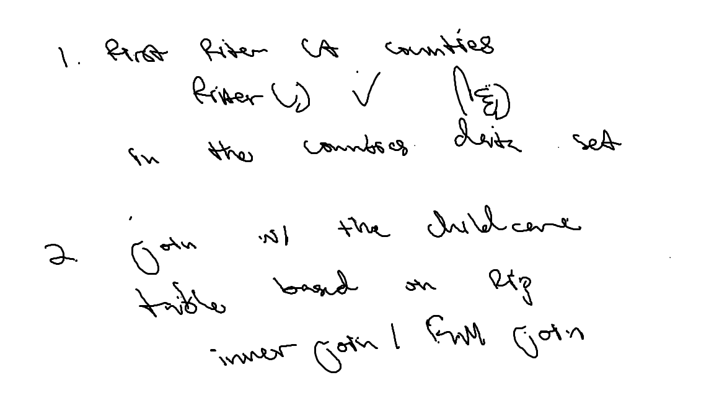

::: {.callout-tip collapse="true"}
I advise you to focus particularly on:

-   Setting chunk options carefully.

-   Making sure you don't print out more output than you need.

-   Making sure you don't assign more objects than necessary. Avoid "object junk" in your environment.

-   Making your code readable and nicely formatted.

-   Thinking through your desired result **before** writing any code.
:::

[Download starter .qmd file](../../student-versions/labs/lab4-childcare.qmd)

## The Data

In this lab we're going look at the median weekly cost of childcare in California. The data come to us from [TidyTuesday](https://github.com/rfordatascience/tidytuesday). A detailed description of the data can be found [here](https://github.com/rfordatascience/tidytuesday/blob/master/data/2023/2023-05-09/readme.md). **You will need to use this data dictionary to complete the lab!**

We also have information from the California State Controller on tax revenue for california counties from 2005 - 2018. I compiled the data from [this website](https://counties.bythenumbers.sco.ca.gov/#!/year/default) for you. Note that there is no data for San Franscisco County. The variables included in the `ca_tax_revenue.csv` data file (loaded below) include:

- `entity_name`: County name
- `year`: fiscal year
- `total_property_taxes`: total revenue in $ from property taxes
- `sales_and_use_taxes`: total revenue in $ from sales and use taxes


**0. Load the appropriate libraries and the data.**

```{r setup}
# load libraries
library(readr)
library(tidyverse)
library(janitor)
library(ggplot2)
```

```{r load_data}
# load data
childcare_costs <- read_csv('https://raw.githubusercontent.com/rfordatascience/tidytuesday/master/data/2023/2023-05-09/childcare_costs.csv')
counties <- read_csv('https://raw.githubusercontent.com/rfordatascience/tidytuesday/master/data/2023/2023-05-09/counties.csv')

tax_rev <- read_csv('https://raw.githubusercontent.com/manncz/stat-331-s25/main/labs/lab4/data/ca_tax_revenue.csv')
```

**1. Briefly describe the data (~ 4 sentences). What information does it contain?**

In tax revenue data it includes the county, the year, and a column of revenue from property tax, and another column of revenue from sales and use tax. While in the counties data it has the county name, abbreviation, state the county is in, and the fips code of that county. In the childcare costs data, it consists of unemployment rate of various groups, labor force participation rate of various groups, poverty rates, median earnings on different groups, total population and its various race percentages, number of households with a certain amount of children under a certain age, the percent of certain groups in certain occupations, and aggregated weekly, full-time median price charged for Center-based Care for certain children age groups. 


## California Childcare Costs

**2. Let's focus only on California. Create a `ca_childcare` dataset containing (1) county information and (2) all information from the `childcare_costs` dataset.**

**a. Sketch a game plan for completing this task. You should do all of this within one pipeline**



**b. Implement/code your game plan to create the dataset of childcare costs in California.** *Checkpoint: There are 58 counties in CA and 11 years in the dataset. Therefore, your new dataset should have 638 observations.*

```{r}
# code for Q2
ca_childcare <- counties |>
  filter(state_abbreviation == "CA") |>
  inner_join(childcare_costs,
             by = join_by(county_fips_code))
```


**3. Now, lets add the tax revenue information to the `ca_childcare` dataset. Add the data from `tax_rev` for the counties and years that are already in the `ca_childcare` data. Overwrite the old `ca_childcare` data with this dataset.** *Checkpoint: you are just adding columns here, so your new dataset should still have 638 observations*

```{r}
# code for Q3
ca_childcare <- ca_childcare |>
  left_join(tax_rev,
            by = join_by(county_name == entity_name, study_year == year))
```


**4. Using a function from the `forcats` package, complete the code below to create a new variable where each county is categorized into one of the [10 Census regions](https://census.ca.gov/regions/) in California. Use the Region description (from the plot), not the Region number.** The code below will help you get started.

```{r}
#| code-fold: true

# defining 10 census regions

superior_counties <- c("Butte","Colusa","El Dorado",
                       "Glenn","Lassen","Modoc",
                       "Nevada","Placer","Plumas",
                       "Sacramento","Shasta","Sierra","Siskiyou",
                       "Sutter","Tehama","Yolo","Yuba")

north_coast_counties <- c("Del Norte","Humboldt","Lake",
                          "Mendocino","Napa","Sonoma","Trinity")

san_fran_counties <- c("Alameda","Contra Costa","Marin",
                       "San Francisco","San Mateo","Santa Clara",
                       "Solano")

n_san_joaquin_counties <- c("Alpine","Amador","Calaveras","Madera",
                            "Mariposa","Merced","Mono","San Joaquin",
                            "Stanislaus","Tuolumne")

central_coast_counties <- c("Monterey","San Benito","San Luis Obispo",
                            "Santa Barbara","Santa Cruz","Ventura")

s_san_joaquin_counties <- c("Fresno","Inyo","Kern","Kings","Tulare")

inland_counties <- c("Riverside","San Bernardino")

la_county <- "Los Angeles"

orange_county  <- "Orange"

san_diego_imperial_counties <- c("Imperial","San Diego")
```

```{r}
# finish this code for Q4

ca_childcare <- ca_childcare |> 
  mutate(county_name = str_remove(county_name, " County")) |>
  mutate(census_regions = fct_collapse(.f = county_name,
               "superior_counties" = superior_counties,
               "north_coast_counties" = north_coast_counties,
               "san_fran_counties" = san_fran_counties,
               "n_san_joaquin_counties" = n_san_joaquin_counties,
               "central_coast_counties" = central_coast_counties,
               "s_san_joaquin_counties" = s_san_joaquin_counties,
               "inland_counties" = inland_counties,
               "la_county" = la_county,
               "orange_county" = orange_county,
               "san_diego_imperial_counties" = san_diego_imperial_counties))

```

::: callout-tip

I have provided you with code that eliminates the word "County" from each of the county names in your `ca_childcare` dataset. You should keep this line of code and pipe into the rest of your data manipulations.

You will learn about the `str_remove()` function from the `stringr` package next week!

:::


**5. Let's consider the median household income of each region, and how that income has changed over time. Create a table with ten rows, one for each region, and two columns, one for 2008 and one for 2018 (plus a column for region). The cells should contain the `median()` of the median household income (expressed in 2018 dollars) of the `region` and the `study_year`. Order the rows by 2018 values from highest income to lowest income.**

::: callout-tip

This will require transforming your data! Sketch out what you want the data to look like before you begin to code. You should be starting with your California dataset that contains the regions.

:::

```{r}
# code for Q5
delete later for commit/push
```


**6. Which California `region` had the lowest `median` full-time median weekly price for center-based childcare for infants in 2018? Does this `region` correspond to the `region` with the lowest `median` income in 2018 that you found in Q4?**

::: callout-warning

The code for the first question should give me the EXACT answer. This means having the code output the exact row(s) and variable(s) necessary for providing the solution. To answer the second question, compare this output with the output from Q4.

:::

```{r}
# code for Q6
```

**7. The following plot shows, for all ten regions, the change over time of the full-time median price for center-based childcare for infants, toddlers, and preschoolers. Recreate the plot. You do not have to replicate the exact colors or theme, but your plot should have the same content, including the order of the facets and legend, reader-friendly labels, axes breaks, and a loess smoother.**

:::callout-tip
# Hints
This will require transforming your data! Sketch out what you want the data to look like before you begin to code. You should be starting with your California dataset that contains the regions.

A point on the plot represents one county and year.

You should use a `forcats` function to reorder the legend automatically

Try setting `aspect.ratio = 1` in `theme()` if your plot is squished

Again, your plot does not need to look exactly like this one!!

Remember to avoid "object junk" in your environment!
:::


```{r}
# code for Q7
```

## Median Household Income vs. Childcare Costs for Infants

::: callout-tip

#### Refresher on Linear Regression

While a second course in statistics is a pre-requisite for this class, [here](https://moderndive.com/10-inference-for-regression.html) is a refresher on simple linear regression with a single predictor.

:::

**8. Create a scatterplot showing the relationship between median household income (expressed in 2018 dollars) and the full-time median weekly price charged for center-based childcare for an infant in California. Overlay a linear regression line (lm) to show the trend.**

```{r}
# plot for scatterplot
```

**9. Look up the documentation for `lm()` and fit a linear regression model to the relationship shown in your plot above (recall: $y = mx+b$). Identify the coefficient estimates from the model.**

```{r}
# complete the code provided
reg_mod1 <- lm()
summary(reg_mod1)
```

**10. Do you have evidence to conclude there is a relationship between the median household income and the median weekly cost of center-based childcare for infants in California? Cite values from your output for support.**


## Open-Ended Analysis

Let's give you a taste of what to expect for the take-home portion of the midterm exam.

**11. Investigate the full-time median price for childcare in a center-based setting versus the full-time median price for childcare in a family (in-home) setting in California. Posit a research question. This could include any other variables in the dataset as well. Present one table of summary statistics and one plot that helps to address your research question.**

This write-up should include:

  - A description of the data you are using
  - Your research question
  - One **well-designed** table of summary statistics
      - Note, this should **not** be inference (results from a statistical test)
      - This should be a summary table of the data itself, like Q5 
  - One **well-designed** plot
  - Descriptions of the table and plot that both:
      - Explain what the table/plot is literally showing (e.g. the median cost by year)
      - Analyze what you learn from the table/plot about your research question
      
The table and plot should not show reduntant information, they should be used to 
gain more insight on your question.


Dr. C will be reading through these and providing some feedback!
